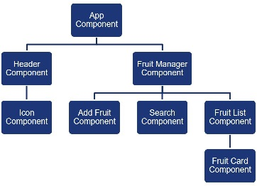
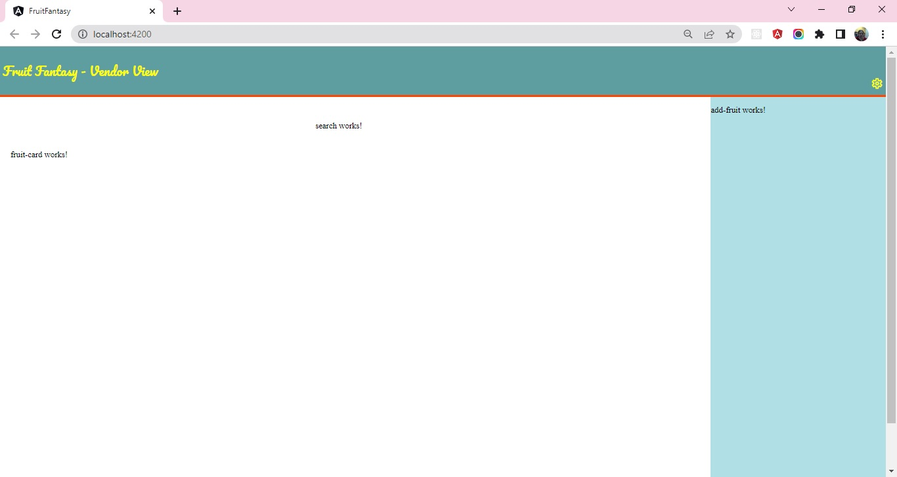
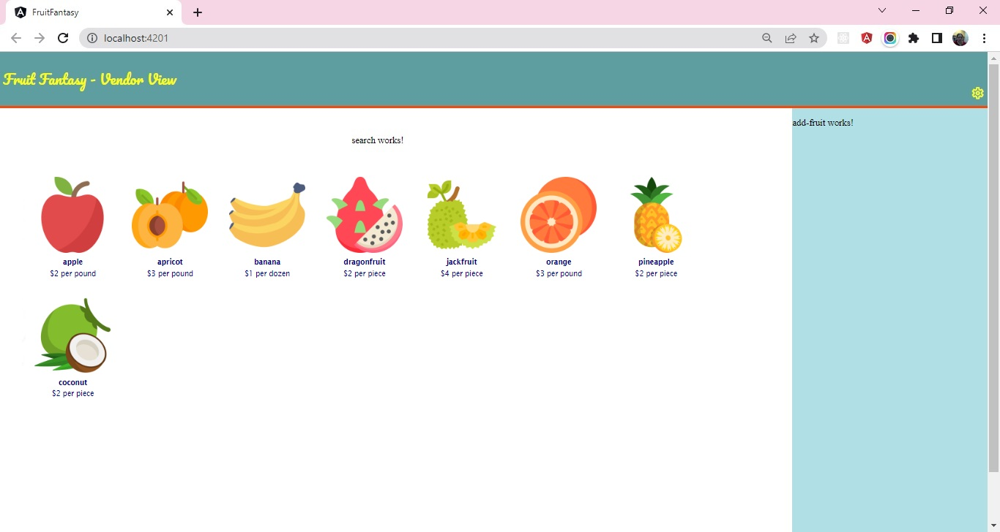
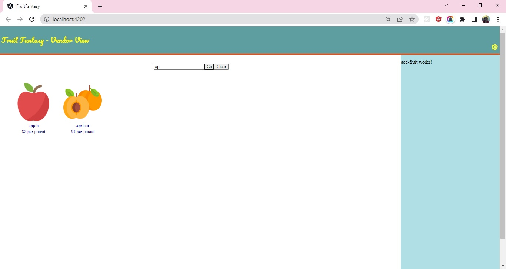

## Sprint 3 : Implement Interactions between Angular Components

### This sprint has 3 demos

[**Demo 1 :: Create Components for Fruit Fantasy**](demo-1-component-hierarchy)

Create component hierarchy for the Fruit Fantasy app.

Based on the hierarchy, create Angular Components in the Fruit Fantasy app.

Render the components as per the relationship depicted in the hierarchy.

#### Guidelines to identify components
1. Use Single Responsibility Principle and Do not Repeat Yourself principle to identify components
2. Header of the page should only display page headings with icons
    - Header would be one component.
3. There could be multiple icons in the header each serving a specific responsibility, with same look and feel.
    - Icon could be another component rendered by Header component.
4. The main section of the page, need to manage fruit data residing in Fruits array externally.
    - Fruit Manager component can be created that reads data from the external fruit array.
5. Following are the key tasks that would be performed on the fruit data:
    - Add fruit
    - Search fruit
    - Display fruit list 
    - Each item in the list should be displayed with its caption, price and fruit image
6. Each of the above tasks would be handled as a single responsibility by following components:
    - Add-Fruit component
    - Search component
    - Fruit-List component
    - Fruit-Card component

#### Identifying Relationship between components to build Component Hiearchy

1. App component is the bootstrap component which would be the root in the component hiearchy.
2. Header and Fruit-Manager would be rendered by App component, that makes them children of App component.
3. Header renders Icon component, hence Icon is child of Header component
4. Fruit-Manager component has to manage fruits through add, search and display operations.
    - Hence Add-Fruit, Search and Fruit-List are children of Fruit-Manager component
5. Fruit-List component renders fruits as card through Fruit-Card component, making Fruit-Card child of Fruit-Manager component

The complete hiearchy can be created as depicted by the component hiearchy diagram shown below:



Use Angular CLI command `ng generate component <component-name>` or `ng g c <component-name>` to create components.

Render the components as per the relationship depicted in the hierarchy.

Also, ensure the models `Fruit` and `Fruits` are re-created as created in the previous sprint demo.

Copy the code for designing header in `Header` component.

Copy the code for displaying `settings` icon in `Icon` component.

Below is the snapshot of expected output:



##### Problem Statement

[**Demo 2 :: Fruit Fantasy - Display List of Fruits**](demo-2-display-fruit-list)

##### Problem Statement

In the Fruit Fantasy app modify the Fruit-Manager component to create list of fruit object.

The Fruit-Manager should pass this list to Fruit-List component which will further pass one item each to Fruit-Card component to render the fruit details.

#### Steps

1. **Fruit-Manager Component**
    1. In `.ts` file, create `fruits` array property and to it assign the FRUITS array exported from `models/fruits.ts` file.
    2. In `.html` file, pass the fruits array property to `fruits` property of `Fruit-List` component.
    ```html
        <app-fruit-list [fruits] = "fruits"></app-fruit-list>
    ```
2. **Fruit-List Component**
    1. In `.ts` file, declare `fruits` property of type `Fruit` array and annotate it with `@Input()` decorator to mark this property as input property. This will allow the `fruits` property to receive inputs from the parent (`Fruit-Manager`) component.
    ```javascript
        @Input()
        fruits: Fruit[] = [];
    ```
    **Note: `Input` needs to be imported from `@angular/core` module.**

    2. In `.html` file, render `Fruit-Card` component using `*ngFor` directive to render one instance each for the fruit traversed.
    3. Pass the `fruit` object traversed as input to `fruit` property of `Fruit-Card` component.

    ```html
        <app-fruit-card class="card" *ngFor="let fruit of fruits" [fruit] = "fruit">
    
        </app-fruit-card>
    ```
    4. In `.css` file, add the following CSS class to style
    ```css
        .card {
            display: inline-flex;
            align-items: flex-start;
        }
    ```
3. **Fruit-Card Component**
    1. In `.ts` file, declare `fruit` property of type `Fruit` and annotate it with `@Input()` decorator to mark this property as input property and enable it to receive input from the parent (`Fruit-List`) component.
    ```javascript
        @Input()
        fruit?: Fruit;
    ```
    2. In `.html` file, render `fruit name`, `image`, `price` and `unit` fields.
    ```html
        <a href="">
            <div class="card-content">
                
                <h4>{{fruit?.name}}</h4>
                ${{fruit?.price}} per {{fruit?.unit}}
            </div>
        </a>
    ```
    3. In `.css` file, add the following CSS class to style
    ```css
        .card-content{
            text-align: center;
            margin: 15px;
            padding: 3px;
            height: 170px;
        }

        .card-content h4 {
            margin-block-start: 0.5em !important;
            margin-block-end: 0.5em !important;
        }

        a {
            text-decoration: none;
            color: navy;
            font-family: 'Lucida Sans', 'Lucida Sans Regular', 'Lucida Grande', 'Lucida Sans Unicode', Geneva, Verdana, sans-serif;
            font-size: 0.75em;
        }
    ```

Below is the snapshot of expected output:



[**Demo 3 :: Fruit Fantasy - Search Fruit in Fruit-List**](demo-3-search-fruit)

##### Problem Statement

In the Fruit Fantasy app modify the Fruit-List component to filter list of fruits based on the search input received.

The Fruit-List component should render Search component that accepts input from user with the name of fruit to search.

The Search component should emit event with the fruit name and pass the data to Fruit-List component.

The Fruit-List component should handle the event and use the fruit name passed to filter fruit list by the fruit name.

#### Steps

1. **Search Component**
    1. In `.html` file, design search layout with text box and two buttons - `Go` and `Clear`
        ```html
            <div class="search-box">
                <input type="text" placeholder="Enter fruit name" name="fruitName">
                <button>Go</button>
                <button>Clear</button>
            </div>
        ```
    2. In `.ts` file, declare property `fruitName` of type `string`.
    3. In `.html`, implement 2-way binding using `ngModel` between search text box and property `fruitName`.
        - **Note: To use `ngModel` import `FormsModule` in `app.module.ts` from `@angular/forms`.
        ```html
        <input type="text" placeholder="Enter fruit name" name="fruitName" [(ngModel)] = "fruitName">
        ```
    4. In `.ts` file, define two functions `searchFruit()` and `clearSearch()`
        ```javascript
            searchFruit() {

            }

            clearSearch() {
                
            }
        ```
    5. In `.html` file, associate these methods with `click` event of `Go` and `Clear` buttons respectively.
        ```html
            <button (click)="searchFruit()">Go</button>
            <button (click)="clearSearch()">Clear</button>
        ```
    6. When the `Go` button is clicked, the search text should be passed to parent component by emitting event. 
    
    In `.ts` file, to emit event, declare output property `searchTextChanged` of type `EventEmitter` annotated with `@Output()` decorator
        ```javascript
            @Output()
            searchTextChanged: EventEmitter<string> = new EventEmitter<string>();
        ```
    **Note: `Output` should be imported in component class from `@angular/core` module.**
    7. In `.ts` file, complete the code in `searchFruit()` method that will get called when the `Go` button is clicked. The code should emit the `searchTextChanged` event with fruit name value to the parent component.
        ```javascript
        searchFruit() {
            this.searchTextChanged.emit(this.fruitName);
        }
        ```
    8. In `.ts` file, complete the code in `clearSearch()` method that will get called when the `Clear` button is clicked. The code should emit the `searchTextChanged` with empty fruit name value.
        ```javascript
        clearSearch() {
            this.fruitName = "";
            this.searchTextChanged.emit(this.fruitName);
        }
        ```
    
2. **Fruit-Manager Component**
    1. The event emitted by child component `Search` should be listened and handled by the parent `Fruit-Manager` component.
    2. In `.html` file, implement event binding to listen to event and associate event handler
    ```html
    <app-search (searchTextChanged)="onSearchTextChanged($event)"></app-search>
    ```
    - **Note**: Here $event receives the fruit name passed by child component while emitting the event.
    3. In `.ts` file, declare `onSearchTextChanged()` method
    ```javascript
    onSearchTextChanged(fruitName: string) {

    }
    ```
    4. The `onSearchTextChanged()` method should filter `fruits` array based on fruit name passed. However, if the fruit name is empty then it should reset `fruits` array with original values from `FRUITS` array
    ```javascript
    onSearchTextChanged(fruitName: string) {
        if(fruitName === '' || !fruitName)
            this.fruits = FRUITS;
        else
        {
            this.fruits = FRUITS;
            this.fruits = this.fruits.filter(fruit => fruit.name?.startsWith(fruitName));
        }
    }
    ```
    - **Note:** As the `fruits` array gets updated with search results, the same array is passed as input to `Fruit-List` component. The `Fruit-List` component then renders `Fruit-Card` components with updated list contents.

    
Below is the snapshot of expected output:

